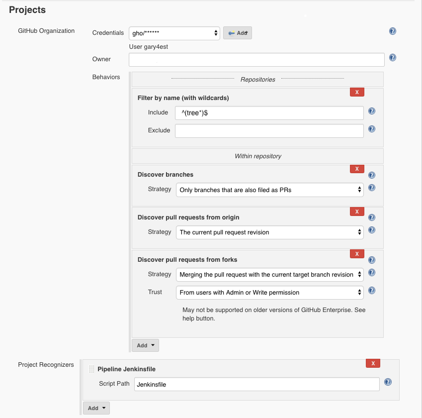

# Build on Pull Request & Deploy on Merge to Master Only

In the following example we will call our deploy pipeline (tree-deploy) when we merge the PR to Master. On PR changes the Pipeline will run a build only. To do this we need to add the following stage to our [Jenkinsfile](../cicd/build/Jenkinsfile). On merge to master, Jenkins will build the Branch and call the deploy. 


```
stage('Deploy to Dev Environment') {
	when {
                branch 'master'
                expression {isSucceding()}
    }
    steps {
           sh """
           {
                 echo "----------------------------------"
                 echo "INFO: Deploy to Dev Test Listener "
                 echo "----------------------------------"
            } 2> /dev/null
            """

            //Call Deploy Job
            build job: "../tree-deploy/master", parameters: [
                    string(name: 'ENVIRONMENT', value: 'dev'),
                    string(name: 'STACKER_BRANCH', value: 'master'),
                    string(name: 'COMMIT_ID', value: "${env.COMMIT_ID}")
                ]
            }
}
```

### GitHub Repo Webhook

**Let me select individual events**:

1. Pull requests
2. Pushes


### GitHub Organization Configuration

Setup the following in the Jenkins GitHub Organization under the Project configuration section:

**Discover branches**: All branches

**Discover pull requests from origin**: Both the current pull request revision and the pull request merged with the current target branch revison

**Discover pull requests from forks**

Strategy: Merging the pull request with the current target branch revision

Trust: From Users with admin or write permissions




