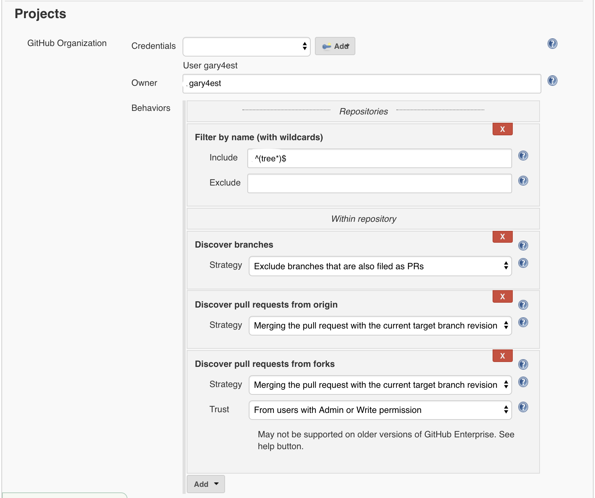

# Call Deploy Pipeline on Merge to Master

In the following example we will call our deploy pipeline (tree-deploy) only when we merge our PR to Master. To do this we need to add the following stage to our [Jenkinsfile](../cicd/build/Jenkinsfile).


```
stage('Deploy to Dev Environment') {
    steps {
           sh """
           {
                 echo "----------------------------------"
                 echo "INFO: Deploy to Dev Test Listener "
                 echo "----------------------------------"
            } 2> /dev/null
            """

            //Call Deploy Job
            build job: "../tree-deploy/master", parameters: [
                    string(name: 'ENVIRONMENT', value: 'dev'),
                    string(name: 'STACKER_BRANCH', value: 'master'),
                    string(name: 'COMMIT_ID', value: "${env.COMMIT_ID}")
                ]
            }
}
```

### GitHub Organization Configuration

Setup the following in the Jenkins GitHub Organization under the Project configuration section:

**Discover branches**: Exclude branches that are also file as PRs

**Discover pull requests from origin**: Merging the pull request with the current target branch revision

**Discover pull requests from forks**

Strategy: Merging the pull request with the current target branch revision

Trust: From Users with admin or write permissions




